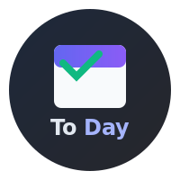

# ToDay - Your Daily Task Manager 📅✅

  
*A minimalist yet powerful daily task manager*

## Features ✨

- **Daily Task Management** - Focus on today's priorities
- **Smart Prioritization** - Color-coded priority system (High/Medium/Low)
- **Quick Add** - Create tasks in seconds
- **Dark/Light Mode** - Eye-friendly themes
- **Cross-Platform** - Works on Android and iOS

## Screenshots 📱
  

## Tech Stack 🛠️

- **Flutter** - Beautiful native apps
- **SQLite** - Local task storage
- **Provider** - State management

## Installation ⚡

1. Ensure Flutter is installed:
   ```bash
    flutter doctor
   ```

2. Clone the repository:
   ```bash
    git clone https://github.com/fiqryx/to-day.git
   ```

3. Install dependencies:
   ```bash
    flutter pub get
   ```

4. Run the app:
   ```bash
    flutter run
   ```


## Configuration ⚙️
Set up environment variables:
```bash
cp .env.example .env
```
default configuration
```ini
APP_NAME=ToDay
DB_NAME=to_day.db
```

## How to Build 🚀
```bash
flutter build apk --release  # Android
flutter build ios --release  # iOS
# or
flutter build apk --split-per-abi # Android
```
#### ✅ Completed (v1.0.6)
- [x] Basic task management
- [x] Priority tagging (High/Medium/Low)
- [x] Light/Dark theme toggle
- [x] Daily progress statistics
- [x] Filtering task by priority

<!-- #### ⏳ In Progress (v1.5)
- [ ] **Sync Alarm**  
  ▸ Smart reminders tied to task deadlines  
  ▸ Customizable alert tones  
  ▸ Snooze functionality   -->

<!-- ### ✨ Planned Features

#### Core Improvements
- [ ] **Cloud Sync**  
  ▸ End-to-end encrypted backup  
  ▸ Cross-device synchronization  
  ▸ Offline mode support  

- [ ] **Recurring Tasks**  
  ▸ "Repeat every X days/weeks/months"  
  ▸ Exception handling for skipped dates  
  ▸ Template tasks  

#### Platform Enhancements  
- [ ] **Widget Support**  
  ▸ iOS home screen widgets  
  ▸ Android widgets  
  ▸ Quick-add from widget  

#### Future Possibilities  
- [ ] Natural language input ("Lunch with Amy at 1pm tomorrow")  
- [ ] Location-based reminders  
- [ ] Team task sharing  
- [ ] Voice command integration -->


## Contributing 🤝
Contributions are welcome! Here's how to get started:

1. Fork the repository
2. Create a feature branch (`git checkout -b feature/amazing-feature`)
3. Commit your changes (`git commit -m 'Add amazing feature'`)
4. Push to the branch (`git push origin feature/amazing-feature`)
5. Open a Pull Request

## License 📄
This project is licensed under the MIT License - see the [LICENSE](LICENSE) file for details.

<!-- ### How to change icon
install deps:
```bash
flutter pub get flutter_launcher_icons
```
add like this:
```yml
flutter_launcher_icons:
  android: "launcher_icon"
  ios: true
  image_path: "assets/logo.png"
``` -->